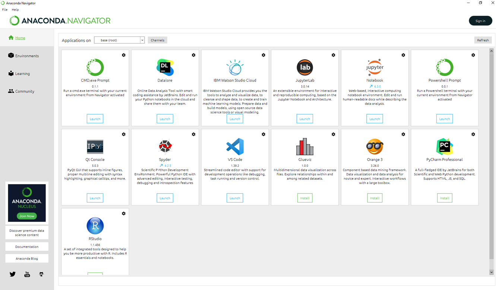

# Anaconda-2021.05 Installation
Author: Bart Gerritsen

E-mail: B.H.M.Gerritsen@TUDelft.nl


## Intended audience
ICT Staff -- Werkplekbeheer, Digital Exam environment, Anaconda admins

## Overview
This procedure describes how to install the TU Delft software portal Anaconda version;

- the Anaconda base versions is the [Anaconda Individual Edition 2021.05](https://www.anaconda.com/products/individual). See menu option *Products*
- the installation assumes **MULTIPLE users** (referred to as: _"system installation"_)
- as per recommendation by Anaconda, Anaconda users sharing a system installation are grouped and granted read and write permissions for the root folder and folders below
- a single `base` environment (a.k.a. environment `anaconda3`), as created and configured in the official installation procedure by Anaconda, residing in `C:\ProgramData\Anaconda3`
- the installation has to be **multi platform**;
    - for Windows (X86_64)
    - for MacOS
    - for Linux
- the TU Delft stylesheet `tudelft.css` will not be installed in the system install, but distributed separately
- this installation includes, among others, `Spyder`, `VS Code`, `Jupyter Notebook`, `JupyterLab`, and `RStudio`
- this installation includes `scikit-learn`, `TensorFlow`, and `PyTorch`, for Machine Learning
- the Individual Edition is an **all-open-source** installation (no licenses required). This includes the installation of [PyCharm Professional with Anaconda Plugin](https://www.jetbrains.com/pycharm/promo/anaconda/) offered and promoted as part of the official installation, and **free-for-academic** use, a free [Community Edition of the JetBrains Datalore](https://datalore.jetbrains.com/) for online editing and execution of Jupyter notebooks, and a trial version of [IBM Watson Studio for Anaconda users](https://dataplatform.cloud.ibm.com/login), that lets you run IBM Notebooks on IBM's Watson Studio for AI and data science, in the cloud.

After this installation, and after adding a few extra packages as per demand by various users in the Faculties, the packaging can commence and the final packaged version can be transferred to the [TU Delft Software Portal](https://software.tudelft.nl).

**Remark**
Students or Staff requiring an installation under _their own user account_ can download and installer from the [Anaconda site](https://www.anaconda.com/products/individual), install, and activate or install the additional packages themselves. If for a minimum installation or just for a Python interpreter, they may want to install `miniconda`.

## Resources
1. [Anaconda Individual Edition 2021.05](https://www.anaconda.com/products/individual)
1. [Introduction Anaconda Individual Edition](https://www.anaconda.com/blog/individual-edition-2021-05)
1. [Installation procedure for multiple users -- system installation](https://docs.anaconda.com/anaconda/install/multi-user/)
1. [PyCharm Professional with Anaconda plugin](https://www.jetbrains.com/pycharm/promo/anaconda/)
1. [Packages](https://docs.anaconda.com/anaconda/packages/pkg-docs/)
1. [Miniconda resources](https://docs.conda.io/en/latest/miniconda.html)
1. [Hashes](https://docs.anaconda.com/anaconda/install/hashes/)

## Installation -- what steps need to be undertaken?

 * Stage 1: install [Anaconda Individual Edition](https://www.anaconda.com/products/individual) (details are given below)

 * Stage 2: post-install the extra packages as specified by Faculties during the Consultation Round (see below)

### Stage 1: Install Anaconda Individual Edition

1. download the **installer** from the [download site](https://www.anaconda.com/products/individual), for Windows, MacOs, or Linux (see below)
1. install the software as it comes; select **multiple**  users (all users) for a system install
1. make a user group `Anaconda-Users` and adjust the file access rights for this group as specified in  [the installation procedure](https://docs.anaconda.com/anaconda/install/multi-user/)
1. verify that the installation has been successful (see below)

#### Documentation Windows installation procedure
1. [single user](https://docs.anaconda.com/anaconda/install/windows/)
1. [multiple user](https://docs.anaconda.com/anaconda/install/multi-user/#multi-user-anaconda-installation-on-windows)

#### MacOS installation procedure
1. [single user](https://docs.anaconda.com/anaconda/install/mac-os/)
1. [command line install](https://docs.anaconda.com/anaconda/install/mac-os/#using-the-command-line-install)

#### Linux installation procedure
1. [single user](https://docs.anaconda.com/anaconda/install/linux/#installing-on-linux)
1. [multiple users](https://docs.anaconda.com/anaconda/install/multi-user/#multi-user-anaconda-installation-on-linux)

#### Verification the Installation
See [here](https://docs.anaconda.com/anaconda/install/verify-install/) how to verify the installation. Also, see [here](https://docs.anaconda.com/anaconda/user-guide/getting-started/). [This page](https://docs.anaconda.com/anaconda/) also gives some pointers.

#### Troubleshooting
[Problems and troubleshooting](https://docs.anaconda.com/anaconda/user-guide/troubleshooting/)

#### FAQ
[Frequently asked questions](https://docs.anaconda.com/anaconda/user-guide/faq/#distribution-faq-windows-folder)

### Stage 2:

1. add (post-install) the extra packages to complete the installation as desired by the participants in the Consultation round (see specifications below)

Start by opening **Anaconda-Navigator** (from the Windows Start Menu) and from that environment launch PowerShell-Prompt (see image below).



In the PowerShell thus provided, check if the _base environment_ `anaconda3` is selected (as reflected in the prompt; here: `anaconda3`, which is good) and check if `python` and `conda` are in the path, by prompting their versions. The output should show something like:

```PowerShell
(anaconda3) PS C:\Users\bhmgerritsen> python --version
Python 3.8.8
(anaconda3) PS C:\Users\bhmgerritsen> conda --version
conda 4.10.1
(anaconda3) PS C:\Users\bhmgerritsen>
```

We are now good to go installing the extra packages using `conda` commands on the command line. To install, issue the command in the rightmost column, in the table below, one-by-one:

| package name | channel | command |
|:---|:---|:---|
| slycot | conda-forge | `conda install -c conda-forge slycot` |
| control | conda-forge | `conda install -c conda-forge control` |
| nidaqmx-python | conda-forge | `conda install -c conda-forge nidaqmx-python` |
| pulp | conda-forge | `conda install -c conda-forge pulp` |


Finally, still in the PowerShell like above, use `pip` to install packages that cannot be installed by `conda`. Usually, `conda` figures out for each of the packages to be installed, which _version_ is needed to keep the entire environment sane. Generally, `pip` does not do that. To that end, Anaconda has its own pip, to overcome this lack of _version control_:

```powershell
conda list pip
pip                       21.1.2                   pypi_0    pypi
```

Use it to install the remaining packages that insist on `pip`, like so:

```powershell
python -m pip install salabim
python -m pip install coolprop
```

and:

```PowerShell
python -m pip install opencv-python
```

and:

```PowerShell
python -m pip install tsp
```

## Verification installation

It is generally not so easy to provide general guidelines how to verify the installation. Below, a few issues will be addressed and a few hints will be given to check individual modules that show difficulties.


### Where are the modules installed?

Find out as follows:

Open a shell from the Anaconda Navigator. Then start the `Python` interpreter, check its version and do the same with `conda` (see above). Then, in this interactive shell:

```python
Python 3.8.8 (default, Apr 13 2021, 15:08:03) [MSC v.1916 64 bit (AMD64)] :: Anaconda, Inc. on win32
Type "help", "copyright", "credits" or "license" for more information.
>>> from distutils.sysconfig import get_python_lib
>>> print(f'{get_python_lib()}')
C:\Users\bhmgerritsen\anaconda3\Lib\site-packages
>>>
```

this give the installation `site-packages` directory (here: `C:\Users\bhmgerritsen\anaconda3\Lib\site-packages`; apparently this is a `--user` single user installation)


### Which modules have been loaded?

In the interactive shell:

```python
>>> import sys
>>> sys.modules
{'sys': <module 'sys' (built-in)>, 'builtins': <module 'builtins' (built-in)>, '_frozen_importlib': <module 'importlib._bootstrap' (frozen)>, '_imp': <module '_imp' (built-in)>, '_warnings': <module '_warnings' (built-in)>, '_frozen_importlib_external': <module 'importlib._bootstrap_external' (frozen)>, '_io': <module 'io' (built-in)>, 'marshal': <module 'marshal' ... (abbreviated)
```

The are the modules that were loaded (check the [python docs](https://docs.python.org/3/library/sys.html) for details.

### Checking an individual module

```python
>>> import marshal
dir(marshal)
>>> import marshal
>>> dir(marshal)
['__doc__', '__loader__', '__name__', '__package__', '__spec__', 'dump', 'dumps', 'load', 'loads', 'version']
>>> dir(marshal.__package__)
['__add__', '__class__', '__contains__', '__delattr__', '__dir__', '__doc__', '__eq__', '__format__', '__ge__', '__getattribute__', '__getitem__', '__getnewargs__', '__gt__', '__hash__', '__init__', '__init_subclass__', '__iter__', '__le__', '__len__', '__lt__', '__mod__', '__mul__', '__ne__', '__new__', '__reduce__', '__reduce_ex__', '__repr__', '__rmod__', '__rmul__', '__setattr__', '__sizeof__', '__str__', '__subclasshook__', 'capitalize', 'casefold', 'center', 'count', 'encode', 'endswith', 'expandtabs', 'find', 'format', 'format_map', 'index', 'isalnum', 'isalpha', 'isascii', 'isdecimal', 'isdigit', 'isidentifier', 'islower', 'isnumeric', 'isprintable', 'isspace', 'istitle', 'isupper', 'join', 'ljust', 'lower', 'lstrip', 'maketrans', 'partition', 'replace', 'rfind', 'rindex', 'rjust', 'rpartition', 'rsplit', 'rstrip', 'split', 'splitlines', 'startswith', 'strip', 'swapcase', 'title', 'translate', 'upper', 'zfill']
>>> dir(marshal.version)
['__abs__', '__add__', '__and__', '__bool__', '__ceil__', '__class__', '__delattr__', '__dir__', '__divmod__', '__doc__', '__eq__', '__float__', '__floor__', '__floordiv__', '__format__', '__ge__', '__getattribute__', '__getnewargs__', '__gt__', '__hash__', '__index__', '__init__', '__init_subclass__', '__int__', '__invert__', '__le__', '__lshift__', '__lt__', '__mod__', '__mul__', '__ne__', '__neg__', '__new__', '__or__', '__pos__', '__pow__', '__radd__', '__rand__', '__rdivmod__', '__reduce__', '__reduce_ex__', '__repr__', '__rfloordiv__', '__rlshift__', '__rmod__', '__rmul__', '__ror__', '__round__', '__rpow__', '__rrshift__', '__rshift__', '__rsub__', '__rtruediv__', '__rxor__', '__setattr__', '__sizeof__', '__str__', '__sub__', '__subclasshook__', '__truediv__', '__trunc__', '__xor__', 'as_integer_ratio', 'bit_length', 'conjugate', 'denominator', 'from_bytes', 'imag', 'numerator', 'real', 'to_bytes']
```

This way, further inspection can be carried out as to the content of the installed package. After a first inspection, a test program may reveal and assess correct operations.

Done.


# Appendix I

Looking for additional packages (for Stage 2) proceeds as follows. Open a PowerShell Prompt from the Anaconda-Navigator, as shown above. Next:

1. to check if a package is installed, use `conda list <package name>`

2. to search for info on a package on the web, in a specfic *channel*, use
`conda search -c <channel-name> --info <package name>`

Example: see if `numpy` has already been installed on our system installation:

```PowerShell
conda list numpy
```

yields the output:

```PowerShell
(Anaconda3) PS C:\Users\bhmgerritsen> conda list numpy
# packages in environment at C:\Users\bhmgerritsen\anaconda3:
#
# Name                    Version                   Build  Channel
numpy                     1.20.1           py38h34a8a5c_0
numpy-base                1.20.1           py38haf7ebc8_0
numpydoc                  1.1.0              pyhd3eb1b0_1
```

informing us that `numpy 1.20.1` has already been installed in environment `C:\ProgramData\Anaconda3` (i.e. the `base` environment for all users), along with its dependencies.

If not installed, search the web for a package can be done as follows.

Example: search the web (channel Conda-Forge) for an additional package, by the name `slycot`:

```PowerShell
conda search -c conda-forge --info slycot
```

yielding a long list of output:

```PowerShell
...
...
...
...
...
slycot 0.4.0.0 py39he12218f_4
-----------------------------
file name   : slycot-0.4.0.0-py39he12218f_4.tar.bz2
name        : slycot
version     : 0.4.0.0
build       : py39he12218f_4
build number: 4
size        : 1.2 MB
license     : GPL-2.0-only
subdir      : win-64
url         : https://conda.anaconda.org/conda-forge/win-64/slycot-0.4.0.0-py39he12218f_4.tar.bz2
md5         : 8cf28be61e4902a72f3cb01aa13b2189
timestamp   : 2020-11-01 08:41:31 UTC
dependencies:
  - libblas >=3.8.0,<4.0a0
  - libcblas >=3.8.0,<4.0a0
  - libflang >=5.0.0
  - liblapack >=3.8.0,<4.0a0
  - numpy >=1.19.2,<2.0a0
  - python >=3.9,<3.10.0a0
  - python_abi 3.9.* *_cp39
  - vc >=14.1,<15.0a0
  - vs2015_runtime >=14.16.27012
  - libflang <6.0.0.a0
...
...
...
```

informing us that the Microsoft VisualStudio 2015 runtime needs to be installed, and that this version requires at least Python 3.9 .

# Appendix II

List of packages installed in the base environment (`anaconda3`).

```PowerShell
(anaconda3) PS C:\Users\bhmgerritsen> conda list --show-channel-urls
# packages in environment at C:\Users\bhmgerritsen\anaconda3:
#
# Name                    Version                   Build  Channel
_ipyw_jlab_nb_ext_conf    0.1.0                    py38_0    defaults
alabaster                 0.7.12             pyhd3eb1b0_0    defaults
alembic                   1.6.4              pyhd8ed1ab_0    conda-forge
anaconda                  2021.05                  py38_0    defaults
anaconda-client           1.7.2                    py38_0    defaults
anaconda-navigator        2.0.3                    py38_0    defaults
anaconda-project          0.9.1              pyhd3eb1b0_1    defaults
anyio                     2.2.0            py38haa95532_2    defaults
appdirs                   1.4.4                      py_0    defaults
argh                      0.26.2                   py38_0    defaults
argon2-cffi               20.1.0           py38h2bbff1b_1    defaults
asn1crypto                1.4.0                      py_0    defaults
astroid                   2.5              py38haa95532_1    defaults
astropy                   4.2.1            py38h2bbff1b_1    defaults
async_generator           1.10               pyhd3eb1b0_0    defaults
atomicwrites              1.4.0                      py_0    defaults
attrs                     20.3.0             pyhd3eb1b0_0    defaults
autopep8                  1.5.6              pyhd3eb1b0_0    defaults
babel                     2.9.0              pyhd3eb1b0_0    defaults
backcall                  0.2.0              pyhd3eb1b0_0    defaults
backports                 1.0                pyhd3eb1b0_2    defaults
backports.functools_lru_cache 1.6.4              pyhd3eb1b0_0    defaults
backports.shutil_get_terminal_size 1.0.0              pyhd3eb1b0_3    defaults
backports.tempfile        1.0                pyhd3eb1b0_1    defaults
backports.weakref         1.0.post1                  py_1    defaults
bcrypt                    3.2.0            py38he774522_0    defaults
beautifulsoup4            4.9.3              pyha847dfd_0    defaults
bitarray                  1.9.2            py38h2bbff1b_1    defaults
bkcharts                  0.2                      py38_0    defaults
black                     19.10b0                    py_0    defaults
blas                      1.0                         mkl    defaults
bleach                    3.3.0              pyhd3eb1b0_0    defaults
blosc                     1.21.0               h19a0ad4_0    defaults
bokeh                     2.3.2            py38haa95532_0    defaults
boto                      2.49.0                   py38_0    defaults
bottleneck                1.3.2            py38h2a96729_1    defaults
brotli                    1.0.9                ha925a31_2    defaults
brotlipy                  0.7.0           py38h2bbff1b_1003    defaults
bzip2                     1.0.8                he774522_0    defaults
ca-certificates           2021.4.13            haa95532_1    defaults
cairo                     1.16.0            h63a05c6_1001    conda-forge
certifi                   2020.12.5        py38haa95532_0    defaults
cffi                      1.14.5           py38hcd4344a_0    defaults
chardet                   4.0.0           py38haa95532_1003    defaults
charls                    2.2.0                h6c2663c_0    defaults
click                     7.1.2              pyhd3eb1b0_0    defaults
cloudpickle               1.6.0                      py_0    defaults
clyent                    1.2.2                    py38_1    defaults
colorama                  0.4.4              pyhd3eb1b0_0    defaults
comtypes                  1.1.9           py38haa95532_1002    defaults
conda                     4.10.1           py38haa244fe_0    conda-forge
conda-build               3.21.4           py38haa95532_0    defaults
conda-content-trust       0.1.1              pyhd3eb1b0_0    defaults
conda-env                 2.6.0                         1    defaults
conda-package-handling    1.7.3            py38h8cc25b3_1    defaults
conda-repo-cli            1.0.4              pyhd3eb1b0_0    defaults
conda-token               0.3.0              pyhd3eb1b0_0    defaults
conda-verify              3.4.2                      py_1    defaults
console_shortcut          0.1.1                         4    defaults
contextlib2               0.6.0.post1                py_0    defaults
cryptography              3.4.7            py38h71e12ea_0    defaults
curl                      7.71.1               h2a8f88b_1    defaults
cycler                    0.10.0                   py38_0    defaults
cython                    0.29.23          py38hd77b12b_0    defaults
cytoolz                   0.11.0           py38he774522_0    defaults
dask                      2021.4.0           pyhd3eb1b0_0    defaults
dask-core                 2021.4.0           pyhd3eb1b0_0    defaults
decorator                 5.0.6              pyhd3eb1b0_0    defaults
defusedxml                0.7.1              pyhd3eb1b0_0    defaults
diff-match-patch          20200713                   py_0    defaults
distributed               2021.4.0         py38haa95532_0    defaults
docutils                  0.17             py38haa95532_1    defaults
entrypoints               0.3                      py38_0    defaults
et_xmlfile                1.0.1                   py_1001    defaults
fastcache                 1.1.0            py38he774522_0    defaults
filelock                  3.0.12             pyhd3eb1b0_1    defaults
flake8                    3.9.0              pyhd3eb1b0_0    defaults
flask                     1.1.2              pyhd3eb1b0_0    defaults
freetype                  2.10.4               hd328e21_0    defaults
fsspec                    0.9.0              pyhd3eb1b0_0    defaults
future                    0.18.2                   py38_1    defaults
fuzzywuzzy                0.18.0             pyhd8ed1ab_0    conda-forge
get_terminal_size         1.0.0                h38e98db_0    defaults
gevent                    21.1.2           py38h2bbff1b_1    defaults
giflib                    5.2.1                h62dcd97_0    defaults
glob2                     0.7                pyhd3eb1b0_0    defaults
glpk                      4.65              h8ffe710_1004    conda-forge
greenlet                  1.0.0            py38hd77b12b_2    defaults
h5py                      2.10.0           py38h5e291fa_0    defaults
hdf5                      1.10.4               h7ebc959_0    defaults
heapdict                  1.0.1                      py_0    defaults
html5lib                  1.1                        py_0    defaults
icc_rt                    2019.0.0             h0cc432a_1    defaults
icu                       58.2                 ha925a31_3    defaults
idna                      2.10               pyhd3eb1b0_0    defaults
igraph                    0.9.2                h29cbd77_0    conda-forge
imagecodecs               2021.3.31        py38h5da4933_0    defaults
imageio                   2.9.0              pyhd3eb1b0_0    defaults
imagesize                 1.2.0              pyhd3eb1b0_0    defaults
importlib-metadata        3.10.0           py38haa95532_0    defaults
importlib_metadata        3.10.0               hd3eb1b0_0    defaults
iniconfig                 1.1.1              pyhd3eb1b0_0    defaults
intel-openmp              2021.2.0           haa95532_616    defaults
intervaltree              3.1.0                      py_0    defaults
ipykernel                 5.3.4            py38h5ca1d4c_0    defaults
ipython                   7.22.0           py38hd4e2768_0    defaults
ipython_genutils          0.2.0              pyhd3eb1b0_1    defaults
ipywidgets                7.6.3              pyhd3eb1b0_1    defaults
isort                     5.8.0              pyhd3eb1b0_0    defaults
itsdangerous              1.1.0              pyhd3eb1b0_0    defaults
jdcal                     1.4.1                      py_0    defaults
jedi                      0.17.2           py38haa95532_1    defaults
jinja2                    2.11.3             pyhd3eb1b0_0    defaults
joblib                    1.0.1              pyhd3eb1b0_0    defaults
jpeg                      9b                   hb83a4c4_2    defaults
json5                     0.9.5                      py_0    defaults
jsonschema                3.2.0                      py_2    defaults
jupyter                   1.0.0                    py38_7    defaults
jupyter-packaging         0.7.12             pyhd3eb1b0_0    defaults
jupyter_client            6.1.12             pyhd3eb1b0_0    defaults
jupyter_console           6.4.0              pyhd3eb1b0_0    defaults
jupyter_contrib_core      0.3.3                      py_2    conda-forge
jupyter_contrib_nbextensions 0.5.1              pyhd8ed1ab_2    conda-forge
jupyter_core              4.7.1            py38haa95532_0    defaults
jupyter_highlight_selected_word 0.2.0           py38haa244fe_1002    conda-forge
jupyter_latex_envs        1.4.6           pyhd8ed1ab_1002    conda-forge
jupyter_nbextensions_configurator 0.4.1            py38haa244fe_2    conda-forge
jupyter_server            1.4.1            py38haa95532_0    defaults
jupyterlab                3.0.14             pyhd3eb1b0_1    defaults
jupyterlab_pygments       0.1.2                      py_0    defaults
jupyterlab_server         2.4.0              pyhd3eb1b0_0    defaults
jupyterlab_widgets        1.0.0              pyhd3eb1b0_1    defaults
keyring                   22.3.0           py38haa95532_0    defaults
kiwisolver                1.3.1            py38hd77b12b_0    defaults
krb5                      1.18.2               hc04afaa_0    defaults
lazy-object-proxy         1.6.0            py38h2bbff1b_0    defaults
lcms2                     2.12                 h83e58a3_0    defaults
lerc                      2.2.1                hd77b12b_0    defaults
libaec                    1.0.4                h33f27b4_1    defaults
libarchive                3.4.2                h5e25573_0    defaults
libblas                   3.9.0           1_h8933c1f_netlib    conda-forge
libcblas                  3.9.0           5_hd5c7e75_netlib    conda-forge
libcurl                   7.71.1               h2a8f88b_1    defaults
libdeflate                1.7                  h2bbff1b_5    defaults
libiconv                  1.15                 h1df5818_7    defaults
liblapack                 3.9.0           5_hd5c7e75_netlib    conda-forge
liblapacke                3.9.0           5_hd5c7e75_netlib    conda-forge
liblief                   0.10.1               ha925a31_0    defaults
libpng                    1.6.37               h2a8f88b_0    defaults
libsodium                 1.0.18               h62dcd97_0    defaults
libspatialindex           1.9.3                h6c2663c_0    defaults
libssh2                   1.9.0                h7a1dbc1_1    defaults
libtiff                   4.2.0                hd0e1b90_0    defaults
libxml2                   2.9.10               hb89e7f3_3    defaults
libxslt                   1.1.34               he774522_0    defaults
libzopfli                 1.0.3                ha925a31_0    defaults
llvmlite                  0.36.0           py38h34b8924_4    defaults
locket                    0.2.1            py38haa95532_1    defaults
lxml                      4.6.3            py38h9b66d53_0    defaults
lz4-c                     1.9.3                h2bbff1b_0    defaults
lzo                       2.10                 he774522_2    defaults
m2w64-gcc-libgfortran     5.3.0                         6    defaults
m2w64-gcc-libs            5.3.0                         7    defaults
m2w64-gcc-libs-core       5.3.0                         7    defaults
m2w64-gmp                 6.1.0                         2    defaults
m2w64-libwinpthread-git   5.0.0.4634.697f757               2    defaults
mako                      1.1.4              pyh44b312d_0    conda-forge
markupsafe                1.1.1            py38he774522_0    defaults
matplotlib                3.3.4            py38haa95532_0    defaults
matplotlib-base           3.3.4            py38h49ac443_0    defaults
mccabe                    0.6.1                    py38_1    defaults
menuinst                  1.4.16           py38he774522_1    defaults
mistune                   0.8.4           py38he774522_1000    defaults
mkl                       2021.2.0           haa95532_296    defaults
mkl-service               2.3.0            py38h2bbff1b_1    defaults
mkl_fft                   1.3.0            py38h277e83a_2    defaults
mkl_random                1.2.1            py38hf11a4ad_2    defaults
mock                      4.0.3              pyhd3eb1b0_0    defaults
more-itertools            8.7.0              pyhd3eb1b0_0    defaults
mpir                      3.0.0             he025d50_1002    conda-forge
mpmath                    1.2.1            py38haa95532_0    defaults
msgpack-python            1.0.2            py38h59b6b97_1    defaults
msys2-conda-epoch         20160418                      1    defaults
multipledispatch          0.6.0                    py38_0    defaults
mypy_extensions           0.4.3                    py38_0    defaults
navigator-updater         0.2.1                    py38_0    defaults
nbclassic                 0.2.6              pyhd3eb1b0_0    defaults
nbclient                  0.5.3              pyhd3eb1b0_0    defaults
nbconvert                 6.0.7                    py38_0    defaults
nbformat                  5.1.3              pyhd3eb1b0_0    defaults
nbgrader                  0.6.1            py38haa244fe_1    conda-forge
nest-asyncio              1.5.1              pyhd3eb1b0_0    defaults
networkx                  2.5                        py_0    defaults
nltk                      3.6.1              pyhd3eb1b0_0    defaults
nose                      1.3.7           pyhd3eb1b0_1006    defaults
notebook                  6.3.0            py38haa95532_0    defaults
numba                     0.53.1           py38hf11a4ad_0    defaults
numexpr                   2.7.3            py38hb80d3ca_1    defaults
numpy                     1.20.1           py38h34a8a5c_0    defaults
numpy-base                1.20.1           py38haf7ebc8_0    defaults
numpydoc                  1.1.0              pyhd3eb1b0_1    defaults
olefile                   0.46                       py_0    defaults
openjpeg                  2.3.0                h5ec785f_1    defaults
openpyxl                  3.0.7              pyhd3eb1b0_0    defaults
openssl                   1.1.1k               h2bbff1b_0    defaults
orderedset                2.0.3            py38h294d835_4    conda-forge
packaging                 20.9               pyhd3eb1b0_0    defaults
pandas                    1.2.4            py38hd77b12b_0    defaults
pandoc                    2.12                 haa95532_0    defaults
pandocfilters             1.4.3            py38haa95532_1    defaults
paramiko                  2.7.2                      py_0    defaults
parso                     0.7.0                      py_0    defaults
partd                     1.2.0              pyhd3eb1b0_0    defaults
path                      15.1.2           py38haa95532_0    defaults
path.py                   12.5.0                        0    defaults
pathlib2                  2.3.5            py38haa95532_2    defaults
pathspec                  0.7.0                      py_0    defaults
patsy                     0.5.1                    py38_0    defaults
pep8                      1.7.1                    py38_0    defaults
pexpect                   4.8.0              pyhd3eb1b0_3    defaults
pickleshare               0.7.5           pyhd3eb1b0_1003    defaults
pillow                    8.2.0            py38h4fa10fc_0    defaults
pip                       21.1.2                   pypi_0    pypi
pixman                    0.38.0            hfa6e2cd_1003    conda-forge
pkginfo                   1.7.0            py38haa95532_0    defaults
pluggy                    0.13.1           py38haa95532_0    defaults
ply                       3.11                     py38_0    defaults
powershell_shortcut       0.0.1                         3    defaults
prometheus_client         0.10.1             pyhd3eb1b0_0    defaults
prompt-toolkit            3.0.17             pyh06a4308_0    defaults
prompt_toolkit            3.0.17               hd3eb1b0_0    defaults
psutil                    5.8.0            py38h2bbff1b_1    defaults
ptyprocess                0.7.0              pyhd3eb1b0_2    defaults
py                        1.10.0             pyhd3eb1b0_0    defaults
py-lief                   0.10.1           py38ha925a31_0    defaults
pycairo                   1.20.0           py38h979ce04_1    conda-forge
pycodestyle               2.6.0              pyhd3eb1b0_0    defaults
pycosat                   0.6.3            py38h2bbff1b_0    defaults
pycparser                 2.20                       py_2    defaults
pycurl                    7.43.0.6         py38h7a1dbc1_0    defaults
pydocstyle                6.0.0              pyhd3eb1b0_0    defaults
pyerfa                    1.7.3            py38h2bbff1b_0    defaults
pyflakes                  2.2.0              pyhd3eb1b0_0    defaults
pygments                  2.8.1              pyhd3eb1b0_0    defaults
pylint                    2.7.4            py38haa95532_1    defaults
pyls-black                0.4.6                hd3eb1b0_0    defaults
pyls-spyder               0.3.2              pyhd3eb1b0_0    defaults
pynacl                    1.4.0            py38h62dcd97_1    defaults
pyodbc                    4.0.30           py38ha925a31_0    defaults
pyopenssl                 20.0.1             pyhd3eb1b0_1    defaults
pyparsing                 2.4.7              pyhd3eb1b0_0    defaults
pyqt                      5.9.2            py38ha925a31_4    defaults
pyreadline                2.1                      py38_1    defaults
pyrsistent                0.17.3           py38he774522_0    defaults
pysocks                   1.7.1            py38haa95532_0    defaults
pytables                  3.6.1            py38ha5be198_0    defaults
pytest                    6.2.3            py38haa95532_2    defaults
python                    3.8.8                hdbf39b2_5    defaults
python-dateutil           2.8.1              pyhd3eb1b0_0    defaults
python-editor             1.0.4                      py_0    conda-forge
python-igraph             0.9.1            py38hc48d4f8_0    conda-forge
python-jsonrpc-server     0.4.0                      py_0    defaults
python-language-server    0.36.2             pyhd3eb1b0_0    defaults
python-levenshtein        0.12.2           py38h294d835_0    conda-forge
python-libarchive-c       2.9                pyhd3eb1b0_1    defaults
python_abi                3.8                      1_cp38    conda-forge
pytz                      2021.1             pyhd3eb1b0_0    defaults
pywavelets                1.1.1            py38he774522_2    defaults
pywin32                   227              py38he774522_1    defaults
pywin32-ctypes            0.2.0                 py38_1000    defaults
pywinpty                  0.5.7                    py38_0    defaults
pyyaml                    5.4.1            py38h2bbff1b_1    defaults
pyzmq                     20.0.0           py38hd77b12b_1    defaults
qdarkstyle                2.8.1                      py_0    defaults
qt                        5.9.7            vc14h73c81de_0    defaults
qtawesome                 1.0.2              pyhd3eb1b0_0    defaults
qtconsole                 5.0.3              pyhd3eb1b0_0    defaults
qtpy                      1.9.0                      py_0    defaults
qutip                     4.6.1            py38h2f20550_0    conda-forge
regex                     2021.4.4         py38h2bbff1b_0    defaults
requests                  2.25.1             pyhd3eb1b0_0    defaults
rope                      0.18.0                     py_0    defaults
rtree                     0.9.7            py38h2eaa2aa_1    defaults
ruamel_yaml               0.15.100         py38h2bbff1b_0    defaults
scikit-image              0.18.1           py38hf11a4ad_0    defaults
scikit-learn              0.24.1           py38hf11a4ad_0    defaults
scipy                     1.6.2            py38h66253e8_1    defaults
seaborn                   0.11.1             pyhd3eb1b0_0    defaults
send2trash                1.5.0              pyhd3eb1b0_1    defaults
setuptools                52.0.0           py38haa95532_0    defaults
simplegeneric             0.8.1                    py38_2    defaults
singledispatch            3.6.1           pyhd3eb1b0_1001    defaults
sip                       4.19.13          py38ha925a31_0    defaults
six                       1.15.0           py38haa95532_0    defaults
snappy                    1.1.8                h33f27b4_0    defaults
sniffio                   1.2.0            py38haa95532_1    defaults
snowballstemmer           2.1.0              pyhd3eb1b0_0    defaults
sortedcollections         2.1.0              pyhd3eb1b0_0    defaults
sortedcontainers          2.3.0              pyhd3eb1b0_0    defaults
soupsieve                 2.2.1              pyhd3eb1b0_0    defaults
sphinx                    4.0.1              pyhd3eb1b0_0    defaults
sphinxcontrib             1.0                      py38_1    defaults
sphinxcontrib-applehelp   1.0.2              pyhd3eb1b0_0    defaults
sphinxcontrib-devhelp     1.0.2              pyhd3eb1b0_0    defaults
sphinxcontrib-htmlhelp    1.0.3              pyhd3eb1b0_0    defaults
sphinxcontrib-jsmath      1.0.1              pyhd3eb1b0_0    defaults
sphinxcontrib-qthelp      1.0.3              pyhd3eb1b0_0    defaults
sphinxcontrib-serializinghtml 1.1.4              pyhd3eb1b0_0    defaults
sphinxcontrib-websupport  1.2.4                      py_0    defaults
spyder                    4.2.5            py38haa95532_0    defaults
spyder-kernels            1.10.2           py38haa95532_0    defaults
sqlalchemy                1.4.7            py38h2bbff1b_0    defaults
sqlite                    3.35.4               h2bbff1b_0    defaults
statsmodels               0.12.2           py38h2bbff1b_0    defaults
suitesparse               5.4.0                h5d0cbe0_1    conda-forge
sympy                     1.8              py38haa95532_0    defaults
tbb                       2020.3               h74a9793_0    defaults
tblib                     1.7.0                      py_0    defaults
terminado                 0.9.4            py38haa95532_0    defaults
testpath                  0.4.4              pyhd3eb1b0_0    defaults
textdistance              4.2.1              pyhd3eb1b0_0    defaults
texttable                 1.6.3              pyh9f0ad1d_0    conda-forge
threadpoolctl             2.1.0              pyh5ca1d4c_0    defaults
three-merge               0.1.1              pyhd3eb1b0_0    defaults
tifffile                  2021.4.8           pyhd3eb1b0_2    defaults
tk                        8.6.10               he774522_0    defaults
toml                      0.10.2             pyhd3eb1b0_0    defaults
toolz                     0.11.1             pyhd3eb1b0_0    defaults
tornado                   6.1              py38h2bbff1b_0    defaults
tqdm                      4.59.0             pyhd3eb1b0_1    defaults
traitlets                 5.0.5              pyhd3eb1b0_0    defaults
typed-ast                 1.4.2            py38h2bbff1b_1    defaults
typing_extensions         3.7.4.3            pyha847dfd_0    defaults
ujson                     4.0.2            py38hd77b12b_0    defaults
unicodecsv                0.14.1                   py38_0    defaults
urllib3                   1.26.4             pyhd3eb1b0_0    defaults
vc                        14.2                 h21ff451_1    defaults
vs2015_runtime            14.27.29016          h5e58377_2    defaults
watchdog                  1.0.2            py38haa95532_1    defaults
wcwidth                   0.2.5                      py_0    defaults
webencodings              0.5.1                    py38_1    defaults
werkzeug                  1.0.1              pyhd3eb1b0_0    defaults
wheel                     0.36.2             pyhd3eb1b0_0    defaults
widgetsnbextension        3.5.1                    py38_0    defaults
win_inet_pton             1.1.0            py38haa95532_0    defaults
win_unicode_console       0.5                      py38_0    defaults
wincertstore              0.2                      py38_0    defaults
winpty                    0.4.3                         4    defaults
wrapt                     1.12.1           py38he774522_1    defaults
xlrd                      2.0.1              pyhd3eb1b0_0    defaults
xlsxwriter                1.3.8              pyhd3eb1b0_0    defaults
xlwings                   0.23.0           py38haa95532_0    defaults
xlwt                      1.3.0                    py38_0    defaults
xmltodict                 0.12.0                     py_0    defaults
xz                        5.2.5                h62dcd97_0    defaults
yaml                      0.2.5                he774522_0    defaults
yapf                      0.31.0             pyhd3eb1b0_0    defaults
zeromq                    4.3.3                ha925a31_3    defaults
zfp                       0.5.5                hd77b12b_6    defaults
zict                      2.0.0              pyhd3eb1b0_0    defaults
zipp                      3.4.1              pyhd3eb1b0_0    defaults
zlib                      1.2.11               h62dcd97_4    defaults
zope                      1.0                      py38_1    defaults
zope.event                4.5.0                    py38_0    defaults
zope.interface            5.3.0            py38h2bbff1b_0    defaults
zstd                      1.4.5                h04227a9_0    defaults
```
